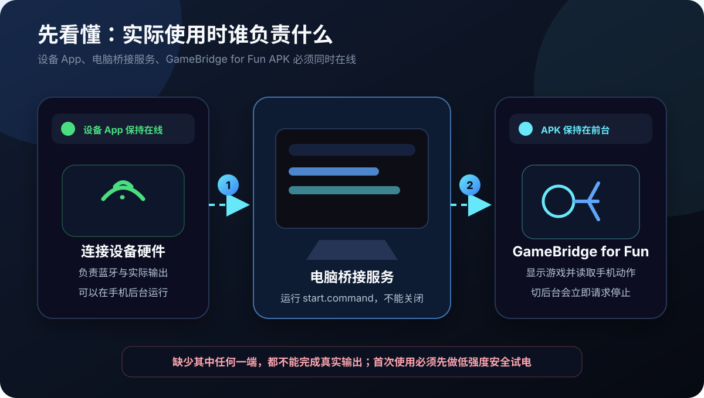
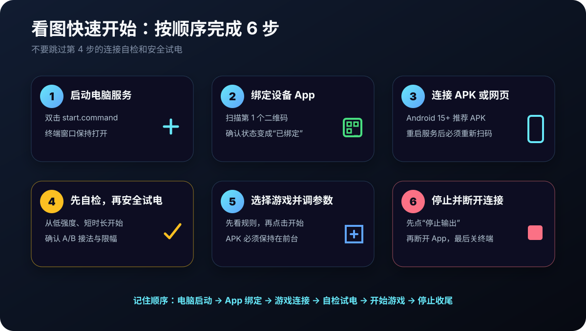
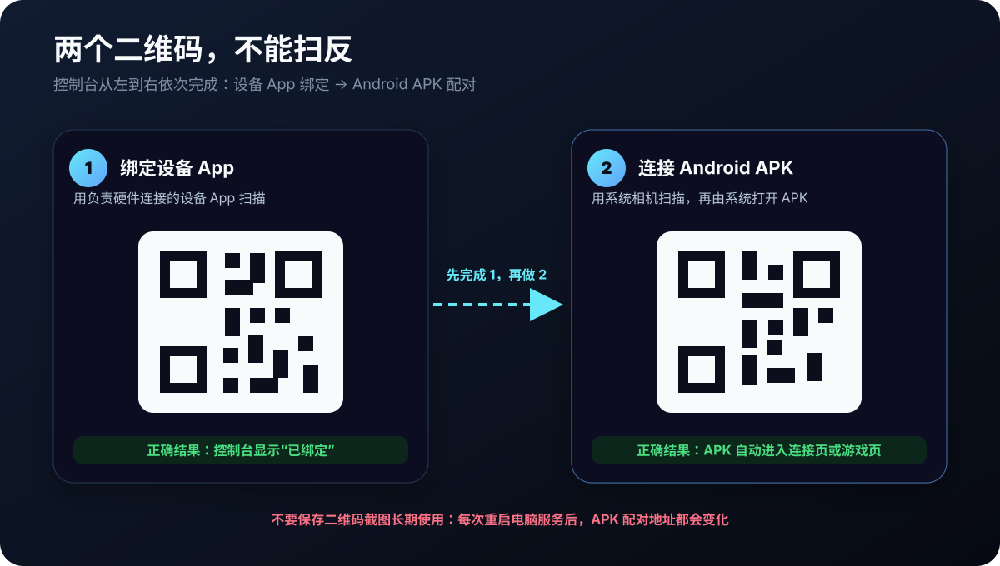
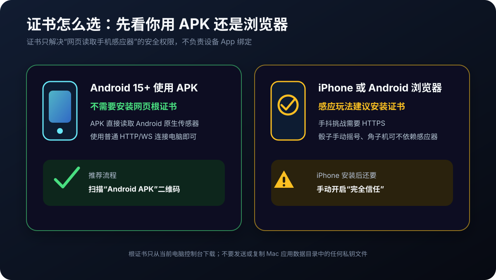
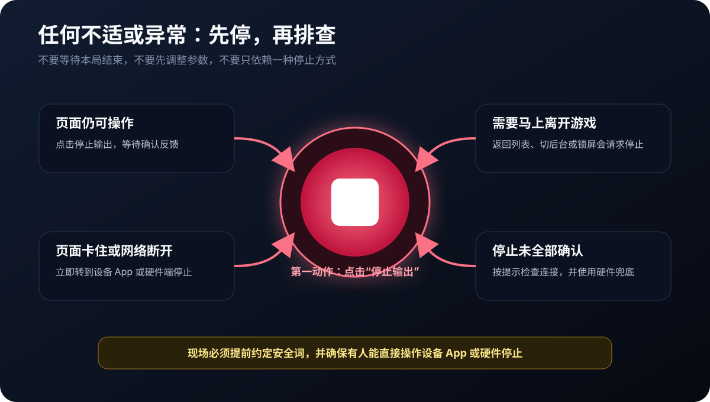
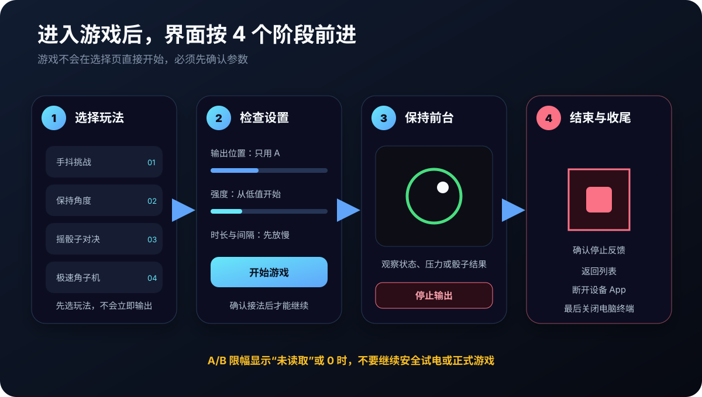
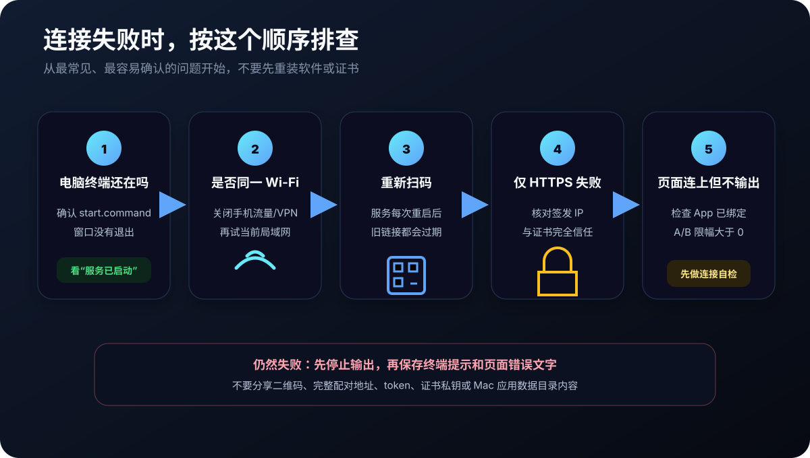

# GameBridge for Fun 1.2.0 用户手册

本文面向实际使用者，说明如何启动、连接、安装手机 HTTPS 证书、选择游戏、调整参数和处理紧急情况。

本项目处于早期 Beta 阶段，仅部分功能完成实机验证。由于实机测试会消耗测试人员，暂未覆盖全部设备、玩法和极端情况。请从低强度开始，避免将软件自动保护作为唯一安全措施。

角子机、骰宝等玩法仅用于无金钱游戏体验，不得用于赌博、押注、收费抽奖、代币兑换或任何涉及金钱与财物输赢的活动。



## 看图快速开始

第一次使用时，先按下图从第 1 步做到第 6 步。图中的二维码、地址和界面数据均为示意，不可用于实际连接。



## 1. 使用前确认

本系统只适合在本地局域网内使用。电脑负责运行桥接服务，手机浏览器负责打开小游戏页面，DG-LAB 4 App 负责连接郊狼 2.0 或 3.0 并接收 V4 远控。

使用前必须确认以下事项：

- 所有人已经明确同意玩法、强度、时长、停止方式和安全词。
- 先从低强度、短时长开始测试，不要直接使用高强度参数。
- 设备电极、连接线、通道 A/B 的实际接法必须提前确认。
- 不要在驾驶、站立不稳、睡眠、饮酒、身体不适或无法立即停止的环境下使用。
- 雷电极速只能由非驾驶、非骑行、非载具控制人员操作和接受输出，并且只能在物理封闭、完成清场的非公共区域使用。
- 任何人说停、离开页面、锁屏或出现异常，都应立即停止输出并重新确认状态。

## 2. 启动服务

本项目的普通使用入口只支持 macOS。双击项目文件夹里的 `start.command`：

```bash
./start.command
```

启动器会在服务运行前完成以下工作：

- 确认当前是 macOS，并找到 Python 3.9 或更高版本。
- 首次运行时创建项目自己的 `.venv` 独立环境，不改动系统 Python。
- 缺少依赖时优先从清华 PyPI 镜像安装；已匹配时完全不访问网络。
- 检查项目文件、目录写入权限、OpenSSL、真实局域网地址和 Android APK 完整性。
- 按这台 Mac 当前的局域网地址生成或更新本地 HTTPS 证书。

如果电脑没有合格的 Python，终端会显示清华 Python 镜像说明和官方备用下载页。安装稳定版 Python 3.12 后重新双击即可；普通使用不需要安装 Node.js、Java 或 Android Studio。

如果 macOS 第一次阻止打开，右键 `start.command` 并选择“打开”。检查失败时服务不会半启动，终端窗口会保留具体原因和处理方法。

服务启动后，终端会显示本机局域网 IP、HTTP 端口、HTTPS 端口、网页 WS 端口、网页 WSS 端口和 App 桥接端口。

常见默认端口：

- 电脑控制台 HTTP：`18080`
- 普通网页通信 WS：`18081`，如被占用会自动递增
- 手机 HTTPS 页面：`18443`
- 手机安全通信 WSS：`18444`
- 设备 App 桥接 WS：`15678`，如被占用会自动递增

如果端口被占用，以终端和控制台页面实际显示为准。

## 3. 电脑控制台

电脑控制台一般会自动打开。如果没有自动打开，在电脑浏览器输入：

```text
http://127.0.0.1:18080/static/index.html
```

如果控制台提示后台通信离线，检查终端里的网页 WS 端口，并在地址后补上实际端口，例如：

```text
http://127.0.0.1:18080/static/index.html?ws=18082
```

控制台后台只接受运行服务的这台电脑连接。不要用手机或其他局域网设备直接打开控制台；这些设备应使用控制台生成的游戏二维码。

控制台包含四个页面：

- `状态监控`：显示 V4 绑定二维码、硬件控制目标、手机游戏入口和关键状态。
- `安全测试`：提供连接自检、A/B 通道低强度安全试电与参数微调。
- `手机证书`：安装本地 HTTPS 根证书，并获取 HTTPS 游戏入口。
- `技术信息`：查看 IP、端口、延迟、通道强度、硬件限幅和电量接入状态。

四个页签和右侧的 `停止 A/B 输出` 会在滚动时保持可见。任何页面出现异常时，都可以直接点击该按钮，不需要先切回 `状态监控`。

## 4. 绑定 DG-LAB 4 App 与郊狼设备

1. 在 iPhone 或 Android 打开 DG-LAB 4 App。
2. 打开电脑控制台的 `状态监控`，用 App 的 `Socket 控制` 扫描 `V4` 二维码。
3. 在 App 的 V4 Socket 页面添加并通过蓝牙连接郊狼 2.0 或 3.0。
4. 电脑控制台会显示硬件型号、设备名称、电量和 A/B 上限；只有一台已连接设备时会自动选择。
5. 如果出现多台兼容设备，在 `控制目标` 中选择实际要使用的设备并点击 `确认控制目标`。
6. 控制台顶部显示 `设备已连接`，并且详情显示所选型号 `已就绪` 后，再进入手机游戏页面。

App 已扫码不代表硬件已经连接。控制台显示 `等待硬件连接`、`需要选择设备`、`安全上限未读取`、`静音` 或 `过热` 时均不会输出。



如果 App 二维码为空：

- 确认终端仍在运行。
- 刷新电脑控制台。
- 查看页面是否提示二维码库加载失败、二维码生成失败或后台通信离线。

如果扫码后出现 `V3 地址仅支持连接 1 台郊狼 3.0`，说明扫描的是旧二维码或历史截图。关闭该页面，确认电脑运行的是当前版本服务，再扫描控制台标有 `V4` 的新二维码。

## 5. 手机 HTTPS 证书安装

手机浏览器对动作、方向和定位权限有安全限制。感应玩法及雷电极速应使用 HTTPS 游戏入口；Android APK 改用原生传感器和系统定位权限，不需要网页证书。

服务启动时会自动检测当前局域网 IP，并为该 IP 签发服务器证书。服务器证书默认 7 天有效，过期或 IP 改变时会自动重签。

手机只需要安装并信任根证书。服务器证书由电脑自动生成，不需要手动安装到手机。

根证书默认 90 天有效。如果根证书过期、被删除或被程序按新安全策略重建，需要重新安装并信任。



### 5.1 iPhone 安装

1. 打开电脑控制台的 `手机证书` 页面。
2. 用 iPhone Safari 扫描 `iPhone 扫描描述文件` 区域的二维码。
3. 下载 `GameBridge for Fun 本地 HTTPS 根证书` 描述文件。
4. 打开 iPhone `设置`。
5. 进入 `通用`，找到 `VPN 与设备管理` 或 `已下载描述文件`。
6. 安装该描述文件。

安装描述文件后，还必须继续操作：

1. 打开 iPhone `设置`。
2. 进入 `通用 > 关于本机 > 证书信任设置`。
3. 找到 `GameBridge for Fun Local Root CA`。
4. 打开完全信任。

不开启完全信任时，HTTPS 页面仍可能被 Safari 拦截，传感器权限也可能无法正常弹出。

### 5.2 Android 浏览器安装

仅使用 Android 浏览器打开 HTTPS 网页时需要本节证书。使用 GameBridge for Fun APK 时不需要安装网页根证书。

1. 打开电脑控制台的 `手机证书` 页面。
2. 用 Android 浏览器扫描 `Android 扫描 .cer 文件` 区域的二维码。
3. 下载 `gamebridge-for-fun-root-ca.cer`。
4. 在系统设置里搜索 `CA 证书`、`从存储安装证书` 或 `安装证书`。
5. 将 `.cer` 安装为 Wi-Fi/VPN 或 CA 证书。

不同 Android 品牌的入口名称不同。安装后如浏览器仍提示不安全，先重启浏览器，再确认系统证书列表里能看到 `GameBridge for Fun Local Root CA`。

### 5.3 证书状态

`手机证书` 页会显示：

- `签发 IP`：HTTPS 游戏入口必须使用这个 IP。
- `IP 来源`：自动检测或手动指定。
- `根证书到期`：到期后需要重新安装并信任。
- `服务器证书到期`：到期后程序自动重签，通常不需要重新安装根证书。
- `根证书 SHA-256 指纹`：用于核对手机正在安装的证书是否来自当前电脑。

### 5.4 证书安全

可以给手机安装或下载的文件：

- `gamebridge-for-fun-root-ca.mobileconfig`
- `gamebridge-for-fun-root-ca.cer`

绝对不要复制或发送的文件：

- `~/Library/Application Support/GameBridge for Fun/certs/private/gamebridge-for-fun-root-ca-key.pem`
- `~/Library/Application Support/GameBridge for Fun/certs/private/gamebridge-for-fun-server-key.pem`

私钥目录仅允许当前 Mac 用户访问，不位于源码仓库中，仍不得手动分享、上传或同步到公共网盘。

完全信任根证书会扩大手机的 HTTPS 信任范围。只在私人设备和可信局域网中安装；结束后建议关闭完全信任，长期不用时应删除描述文件。如果私钥可能泄露，应立即删除手机描述文件和 Mac 中的旧证书，再重新启动服务生成新证书。

## 6. 进入手机游戏页面

角子机和手动骰子可以使用 `状态监控` 页的普通游戏二维码。

手机浏览器中依赖动作、方向或 GPS/GNSS 速度的玩法应使用 `手机证书` 页的 HTTPS 游戏二维码。

手机和电脑必须在同一局域网内。二维码中的 `token` 每次启动服务都会变化，重启服务后要重新扫码。

如果手机打不开页面：

- 确认手机和电脑在同一个 Wi-Fi。
- 使用控制台显示的当前局域网 IP，不要手动套用旧 IP。
- 确认终端仍在运行。
- 用控制台显示的实际地址，不要使用旧截图里的旧 token。
- 若普通游戏页可打开但 HTTPS 入口打不开，检查手机是否已信任根证书，并确认 HTTPS 地址里的 IP 等于 `签发 IP`。

### 6.1 使用 Android APK

APK 支持 Android 15 或更高版本，不兼容 Android 14 及更早系统。

APK 模式需要三个部分同时在线：设备 App 在手机后台维持硬件连接，电脑运行桥接服务，GameBridge for Fun APK 在手机前台读取动作并运行小游戏。设备 App 和 GameBridge for Fun APK 可以运行在同一台 Android 手机上。

1. 安装项目 `APK/GameBridgeForFun-Android15-v1.2.0.apk` 并打开；该包使用项目独立正式签名，不需要安装网页 HTTPS 根证书。
   如果手机装过旧的调试签名包，先卸载旧包再安装；旧包的本地游戏设置会一并清除。
2. 在电脑运行 `start.command`，并先完成设备 App 远控绑定。
3. 用手机系统相机扫描电脑控制台的 `Android APK` 二维码，系统会自动唤起 APK 并连接普通 HTTP/WS 游戏入口。
4. 如果系统相机只显示二维码文本，可复制电脑控制台的普通 HTTP 游戏地址，粘贴到 APK 连接页。
5. 每次重启电脑服务后 token 都会变化，必须重新扫码。

APK 不需要手机 HTTPS 根证书。APK 只允许连接 `10.x`、`172.16-31.x` 或 `192.168.x` 私有地址，并拒绝公网地址、错误页面路径、非法端口和缺失 token 的链接。

进入游戏后，APK 顶部原生工具栏始终提供 `停止 A/B 输出`。连接期间 APK 会保持屏幕常亮；切到后台、锁屏、返回连接页或加载失败时会取消常亮并请求停止输出。

雷电极速会单独申请 Android 精确定位权限，并要求设备具有 GPS/GNSS。APK 只把速度、精度和采样时间交给游戏页，不传入经纬度；没有 GPS/GNSS 的设备仍可安装并使用其他三个玩法。

如果 APK 页面持续显示“无法打开游戏页面”，先确认电脑服务仍在运行且手机与电脑处于同一 Wi-Fi，再点击“重新连接”；电脑服务重启后必须重新扫码。

## 7. 连接测试与安全试电

正式玩之前，建议先做一次连接测试。

电脑控制台 `安全测试` 页提供：

- `连接自检`：检查控制台、DG-LAB 4 App、所选郊狼、手机游戏页、HTTPS 和 A/B 限幅。
- `安全试电`：按所选 A/B 通道发送一次低强度短时长测试。
- `停止输出`：请求清空 A/B 两路输出。

手机游戏选择页提供：

- `连接自检`：检查手机浏览器到电脑后台的连接、郊狼型号、蓝牙状态、延迟和限幅。
- `试 A`、`试 B`、`试 A+B`：用固定低强度短时长测试对应通道。
- `停止输出`：请求清空 A/B 两路输出。

同一页面的 `设备能力与权限` 是全部玩法共用的检查中心：

- `动作与方向`：手抖挑战和感应骰子需要；手动骰子与角子机不需要。
- `GPS/GNSS 速度`：仅雷电极速需要。手机浏览器必须连续取得系统直接提供的速度；仅有网络定位、没有 GPS/GNSS 或无法给出可靠速度时不能启动。
- `屏幕常亮` 与 `本机震动`：属于辅助体验；不可用时不会阻止游戏，但锁屏仍会触发安全停止。
- 每项都可单独点击 `检查或重试`。权限被拒绝后先到当前网站或系统应用权限中修改，再返回本页重试；程序不能绕过系统强制重新弹窗。

低强度试电默认折叠在 `低强度通道试电` 中，先完成连接自检，再按需要展开。

安全试电只用于确认链路和通道，不用于正式玩法。手机试电固定使用强度 `15`、时长 `1 秒` 和短时间也能立即有感的游戏默认波形；电脑端默认值相同，并允许在 `1～30` 内手动降低或提高强度。后端仍强制限制测试强度最高 `30`、测试时长最长 `1 秒`，并设置约 `1.5 秒` 的测试冷却，前端参数不能绕过这些限制。

如果 A/B 限幅显示“未读取”或为 `0`，对应通道不会输出；静音或过热也会把该路有效上限降为 `0`。A+B 模式要求两路都安全，等待 App 回传真实限幅后再测试。

## 8. 紧急停止

可用的停止方式：

- 电脑控制台置顶栏点击 `停止 A/B 输出`。
- 手机浏览器置顶安全栏点击 `停止 A/B 输出`。
- Android APK 顶部工具栏点击 `停止 A/B 输出`。
- 手机游戏页点击 `返回列表`。
- 手机上滑回桌面、锁屏、切后台、刷新或关闭页面。
- 断开手机浏览器游戏端连接。
- 断开设备 App 绑定。

系统会在这些场景中请求清空 A/B 两路输出。点击手机置顶停止还会取消当前游戏的全部待执行队列并退回玩法列表，重新选择玩法前不会再次输出。每次非零强度还带有自动到期时间，电脑异常退出后 App 会在本次输出时长加约 `0.8 秒` 后自行归零。网络和系统仍有不可控因素，必须在 App 或硬件端保留手动停止手段。



## 9. A/B 通道

游戏选择页提供唯一的 `全局输出设置`。波形与 A/B 通道由所有玩法共用；进入单个游戏后只调整该玩法自己的强度、时间与规则，不再重复选择通道。

可选通道：

- `只用 A`：默认选项，只向 A 通道输出，仅显示并配置 A 上限。
- `只用 B`：只向 B 通道输出，仅显示并配置 B 上限。
- `A+B 同时`：两路同时输出，同时受 A 与 B 各自的独立安全上限保护。

使用 B 通道前必须确认 B 通道实际接法和可接受强度。不要只看网页设置，要以设备实际连接为准。

全局设置折叠标题会直接显示当前组合，例如 `游戏默认 · 只用 A` 或 `经典波形 · A+B`。每个游戏设置页只显示这份全局设置的只读摘要；需要修改时会返回选择页，修改结果立即应用到全部玩法。

页面还会显示“当前玩法强度硬上限”。该值由设备 App 回传的 A/B 限幅和所选通道共同计算；游戏滑杆、旧设置恢复、发送前检查和电脑后台都会再次执行这个上限。App 未连接或限幅未读取时不会把未知值当作 200，也不会允许正式输出。

全局设置同时提供 `输出感觉`：

- `游戏默认（推荐）`：0.1～1 秒短输出也会立即有感，适合第一次测试和快节奏游戏。
- `随机（按本次时长）`：每次输出只选一种波形；短输出自动避开慢启动和持续满幅的预设。
- `经典波形`：可固定选择 16 种感觉；波形过长时会压缩完整节奏，不会只播放无感的开头。

波形只改变一次输出内部的起伏，不会提高用户设置的强度或延长时间。后端限幅、App 通道上限、自动到期和紧急停止仍然生效。

旧版若四个游戏保存的通道设置完全一致，升级后会自动继承；若互相冲突或全局缓存损坏，正式输出会暂停，必须核对实际接线并点击 `确认全局输出`。手机和电脑的 A/B 安全试电仍按每次点击明确选择测试通道，不会改写正式玩法的全局设置。

骰子“每下”、角子机“满槽惩罚”和“没中奖轻电”都按一次完整惩罚计算，用户设置与后端实际执行均不得短于 `1 秒`；旧版保存的 `0.x 秒` 设置会自动提升到 `1 秒`。手抖挑战使用可以随时续发和中断的内部短控制帧，不把内部技术间隔暴露成游戏参数。

## 10. 游戏说明

进入任意游戏后，均按“选择玩法、检查设置、保持前台、停止收尾”的顺序操作。设置页只默认展开当前玩法的基础分组，高级参数按需展开；参数上方可恢复当前玩法默认值、校准姿态或开始游戏。所有改动会自动保存，游玩页的当前参数默认折叠。



### 10.1 手抖挑战

玩法：倾斜手机控制弹珠，让弹珠留在安全区内。弹珠离开安全区并持续超过容错时间后，会按偏离程度输出。

手机浏览器应使用 HTTPS 游戏入口；Android APK 使用原生方向传感器。开始前可在全局能力中心检查。

主要设置：

- `游戏模式`：安全半径模式只要求留在圆内；夹缝生存模式要求留在内外圈之间。
- `开始电的强度`：刚触发时的强度。
- `最强电到多少`：偏离很大时接近的强度上限。
- `安全区半径`：越大越容易。
- `夹缝内圈半径`：夹缝模式使用，太靠中心也会失败。
- `倾斜灵敏度`：越高越难控制。
- `出界多久才电`：给短暂晃动留反应时间。

建议先把开始强度设低，把容错时间设长，再逐步调整难度。

### 10.2 摇骰子对决

玩法：你和对手各摇 3 颗骰子。你输了几点，就按设定强度电几下。你或对手任意一方摇出豹子时，不再比较总点数，直接用豹子点数乘豹子倍率作为次数。双方同时豹子时，只按较大的豹子点数算一次。

游戏页会同时显示你和对手的三颗骰子。白色骰子代表你，深色骰子代表对手；开奖前会滚动显示点数，开奖后固定为真实骰子点阵。

例子：

- 每下强度 `20`，每下 `2 秒`，每下间隔 `0.5 秒`。
- 你输了 `5 点`，就以强度 20 输出 5 下，总时长约 `5 × 2 + 4 × 0.5 = 12 秒`。
- 你或对手摇出 `三个 5`，豹子倍率为 `3`，就是 `5 × 3 = 15 下`，总时长约 `15 × 2 + 14 × 0.5 = 37 秒`。

主要设置：

- `每下强度`：每一下使用的强度。
- `每下多久`：每一下持续 `1–30 秒`。
- `每下间隔`：连续多下之间休息多久。
- `豹子倍率`：你或对手任意一方豹子时的次数倍率。
- `单局最多电几下`：可设 `1–36` 下；豹子规则最高为 6 点乘 6 倍，即 36 下。
- `摇晃灵敏度`：越低越容易识别摇动。
- `对手难度`：影响对手点数倾向。
- `允许手动摇号`：开启后可以点按钮开局，不依赖手机传感器。

如果手机传感器权限有问题，可以先开启手动摇号；该模式不会再申请无关的摇晃权限。

骰子单局累计真实输出最多 `300 秒`，每下间隔不计入该预算。例如每下设为 30 秒时最多执行 10 下；界面和后台会分别计算，篡改网页参数也不能突破。

### 10.3 极速角子机

玩法：每局同时摇出三个图标。三个图标全不同时压力上涨，中奖时压力下降，压力满格后触发惩罚。

压力条会随危险程度改变颜色：低压为绿色，中段为黄色，高压为橙色，接近满格时变红并闪烁。支持震动的浏览器会在开奖、危险预警和触发时给出不同节奏的本机震动反馈。

主要设置：

- `没中奖轻电强度`：开启轻电后，空转时使用的强度。
- `满槽惩罚强度`：压力达到 100% 或选择立即惩罚时使用的用户设定值；范围为 0–200，但不会自动使用 200。实际输出还会按所选通道与 App 的 A/B 通道限幅受控截断。
- `满槽惩罚多久`：满槽惩罚单次持续 `1–30 秒`。
- `满槽惩罚后压力`：惩罚结算后清空压力，或保留 100% 继续高压。
- `没中奖轻电`：开启后，全不同也会轻电一下。
- `轻电多久`：每次轻电的持续时间，最低 `1 秒`。
- `电完休息`：轻电或满槽惩罚结束后，至少休息多久才允许下一局开始。
- `转多久开奖`：越短节奏越快。
- `自动连转`：自动进入下一轮。
- `自动连转间隔`：两次开奖之间的等待时间。如果刚刚电过，系统会在自动间隔和电完休息之间取更慢的那个。
- `没中奖涨多少压力`：越高越容易满格。
- `连续没中奖加码`：连续空转时额外上涨压力。
- `小奖降多少压力`：两个相同图案时减少压力。
- `大奖降多少压力`：三个相同图案时减少压力。
- `中奖率档位`：控制大致中奖概率。
- `三个图标全是 7️⃣ 时`：仅在摇出的三个图标全部是 `7️⃣` 时触发；可清空压力、进入满槽但本局不输出，或立即执行满槽惩罚。

选择 `进入满槽：本局不输出` 后，压力会停在 100%。下一局没中奖才执行满槽惩罚；下一局中奖则按中奖规则降低压力，并逃过这次惩罚。

自动连转时，建议先关闭没中奖轻电或使用低强度，确认节奏后再提高。

### 10.4 雷电极速

玩法：手机随载具移动，速度达到用户设置的启动线并稳定 2 秒后，输出强度随速度增加。可以从任意合规速度开始，不要求先静止；没有 GPS/GNSS、无法持续取得系统速度或定位质量不足时不能启动。

本玩法不等于允许在普通道路使用。每次开始都会重新显示 4 项安全确认，不会记住上次选择：

- 操作者和输出接收者均不得是驾驶员、骑行者或载具控制者。
- 接收者必须稳定坐在有充分支撑的多轮载具中；可使用有独立驾驶者的汽车、多轮电动车或稳定三轮载具，不得使用摩托车、自行车、电动自行车、滑板或平衡车。
- 活动区域必须物理封闭、完成清场，禁止在公路、高速公路、开放停车场、人行道或非机动车道使用。
- 现场必须保留设备 App 或硬件手动停止，软件保护不能作为唯一安全措施。

行驶规则：

- `启动速度` 可设为 5–20 km/h，默认 10 km/h；低于该值立即停止，恢复时需高出启动线 1 km/h 并稳定 2 秒。
- `起始强度` 与 `最高强度` 由用户设置，范围不超过 100；实际输出还会被全局通道和设备 App 限幅继续降低。
- 从启动速度到 `满强度速度` 线性增加；55 km/h 后进入保护区并逐步回落，达到 60 km/h 立即停止。
- 超速后必须连续低于 60 km/h 达到用户设置的 `0–10 秒`，才解除暂停；设为 0 时，下一份低于 60 的有效速度即可恢复。恢复期间丢失定位会重新计算等待时间。
- 行驶每轮连续输出可设为 `3–30 秒`，随后强制休息 `3–30 秒`；低速、超速、定位异常和急停可以提前中断。

堵车模式默认关闭。开启后，低于启动速度先立即停止，连续低速 5 秒进入暂停；达到用户设置的 20–120 秒后才进入堵车随机输出。单次输出 `1–20 秒`，随机间隔 10–120 秒，每轮 1–10 次，随后强制休息 30–180 秒；载具恢复移动时立即停止堵车输出，重新稳定验证，再完整执行用户设置的行驶休息后切回行驶规则。

单局时长可在 `1–30 分钟`内拖动设置，到时立即停止。波形和 A/B 通道继续使用选择页的全局设置，不在本玩法内重复配置。

游玩页会持续显示“输出中”“休息中”“间隔中”“等待判定”“已暂停”或“已停止”。页面不要求用户盯着秒数倒计时，但长间隔不会再表现得像程序无响应。

## 11. 技术状态怎么看

电脑控制台和手机选择页会显示关键状态：

- `局域网 IP`：手机访问电脑用的地址。
- `HTTP 端口`：普通网页入口。
- `网页 WS 端口`：普通网页通信。
- `HTTPS 端口`：手机浏览器的安全网页入口。
- `WSS 端口`：HTTPS 页面使用的安全通信。
- `App WS 端口`：设备 App 远控绑定端口。
- `App 桥接协议`：当前应显示 `V4`。
- `郊狼硬件型号`：当前选中的郊狼 2.0 或 3.0。
- `硬件蓝牙状态`：所选设备是否已经通过 App 完成蓝牙连接。
- `App 延迟`：电脑到设备 App 的网络延迟。
- `浏览器延迟`：电脑到手机游戏网页的延迟。
- `A/B 通道强度`：硬件回传的当前强度。
- `A/B 通道限幅`：设备或 App 端设置的强度上限。
- `设备电量`：V4 App 当前回传的硬件电量；尚未回传时显示 `未接入`。
- `A/B 通道安全状态`：显示静音、过热、未形成回路、输出正常或通道屏蔽等状态。
- `设备能力与权限`：显示动作、GPS/GNSS 速度、屏幕常亮和本机震动是否已检查及是否可用。

延迟过高或频繁断开时，应先降低游戏节奏和输出频率。

## 12. 常见问题

遇到连接问题时，先按图中的 1-5 顺序检查，再查看下面的具体问题。



### 12.1 控制台没有二维码

确认终端仍在运行，然后刷新页面。若 WebSocket 端口自动递增，使用终端显示的新控制台地址。

### 12.2 手机打不开游戏页

确认手机和电脑在同一 Wi-Fi。不要使用旧二维码，重启服务后必须重新扫码。

### 12.3 手机不弹传感器权限

使用 `手机证书` 页安装并信任根证书，然后从 HTTPS 游戏入口进入。普通 HTTP 页面可能无法获得动作、方向或定位权限；Android APK 应在系统应用设置中检查对应权限。

### 12.4 HTTPS 页面提示不安全

通常说明手机没有信任本地根证书，或 HTTPS 地址里的 IP 与证书签发 IP 不一致。回到 `手机证书` 页核对 `签发 IP` 和到期时间。

### 12.5 App 已扫码但游戏显示未输出

查看电脑控制台顶部的具体原因。常见原因是郊狼蓝牙未连接、多设备尚未确认目标、A/B 上限未回传、通道静音或过热。只有显示设备已连接且所选通道上限有效时游戏才允许输出。

### 12.6 APK 扫码后没有打开

先确认 APK 已安装。若系统相机不支持打开私有协议，复制电脑控制台显示的普通 HTTP 游戏地址，打开 APK 后粘贴并点击 `连接`。

### 12.7 APK 无法连接电脑

确认手机与电脑在同一 Wi-Fi、`start.command` 仍在运行，并重新扫描本次启动生成的二维码。APK 会拒绝公网地址和旧 token，不能使用历史截图中的链接。

### 12.8 端口不是文档里的默认值

端口被占用时系统会自动递增。以终端输出和控制台技术参数为准。

### 12.9 双击启动文件没有反应

右键 `start.command` 并选择“打开”。如果终端提示 `Permission denied`，在项目目录执行 `chmod +x start.command`；如果提示目录不可写，把完整项目文件夹复制到当前用户的“文稿”目录后再试，不要只复制启动文件。

### 12.10 提示缺少 Python 或依赖安装失败

按终端显示的清华 Python 镜像说明安装 Python 3.12。依赖安装会先使用清华 PyPI 镜像；镜像失败时，启动器只会在你明确输入 `y` 后改用官方 PyPI。

### 12.11 提示没有局域网地址

让 Mac 与手机连接同一个 Wi-Fi，暂时关闭会接管网络的 VPN 后重新启动。程序会优先选择 macOS 的真实 `en` 网卡，并忽略常见 VPN 和虚拟机网卡。

### 12.12 提示 OpenSSL 或 HTTPS 证书失败

先完成 macOS 系统更新后重试。OpenSSL 是生成本机 HTTPS 证书的工具，macOS 通常已经提供；只有系统工具确实缺失时才需要按终端给出的清华 Homebrew 镜像命令安装。

### 12.13 雷电极速提示没有可靠 GPS/GNSS 速度

仅 Wi-Fi 版 iPad、没有 GPS/GNSS 的 Android 设备和只返回网络位置但不返回系统速度的浏览器均不能使用该玩法。确认系统定位服务和精确定位已开启，到开阔区域后在 `设备能力与权限` 中重试；仍失败时只能更换具备 GPS/GNSS 的手机，其他玩法不受影响。

## 13. 首次使用前的低强度故障演练

每次更换手机、路由器、郊狼型号或 App 版本后，先把 App 的 A/B 限幅设为 `15`，再用固定强度 `15`、时长 `1` 秒的安全试电逐项演练：

1. 输出中锁屏或把 Android APK 切到后台。
2. 输出中关闭手机 Wi-Fi。
3. 输出中关闭游戏网页或 APK。
4. 输出中在终端按 `Ctrl+C`。
5. 输出中关闭启动服务的终端窗口。

每一步都必须满足：新的波形不再继续下发，控制台最终显示强度 `0`；停止命令无法确认时应显示“未读取”并要求转到设备 App。长时结算失去页面心跳后，后端会在 3.5 秒内开始自动停机；持续型玩法 0.75 秒没有新脉冲时会自动归零，A/B 硬件命令各自最多等待 1 秒。

任何一项出现持续输出、错误通道仍有输出或停止结果不明确，都应立即在设备 App 中人工停止并中止使用。强制结束进程的 `SIGKILL` 无法被程序捕获，不能把软件自动停机当成唯一停止手段。

## 14. 收尾

使用结束后，建议：

1. 在手机游戏页点击 `停止输出`。
2. 返回游戏列表或关闭手机网页。
3. 断开设备 App 远控绑定。
4. 在终端按 `Ctrl+C` 停止服务。

如需移除 iPhone 证书，到 `设置 > 通用 > VPN 与设备管理` 删除描述文件，并在证书信任设置中确认不再信任该根证书。Android 可在系统证书或安全凭据设置中删除 `GameBridge for Fun Local Root CA`。
